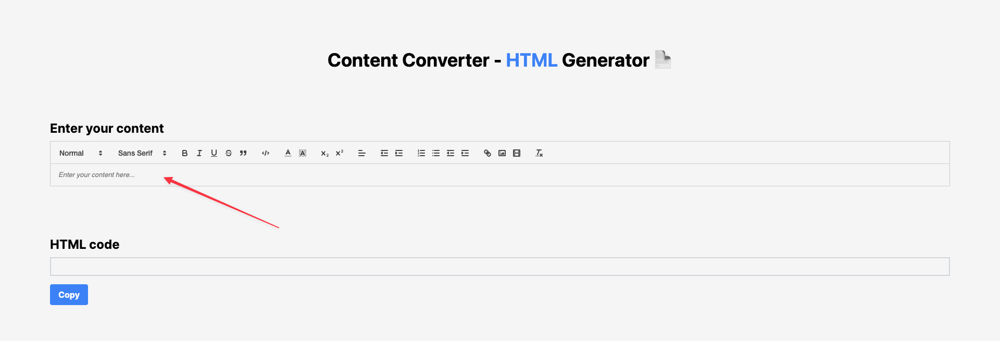
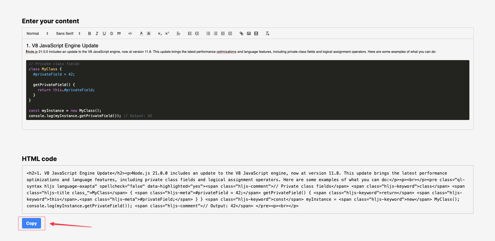
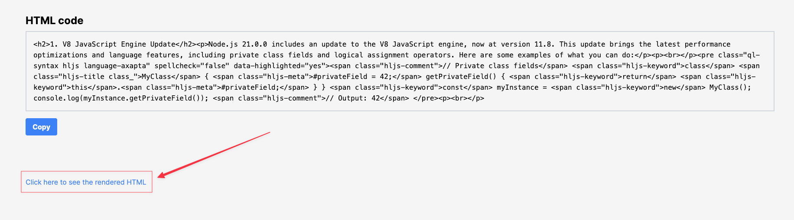
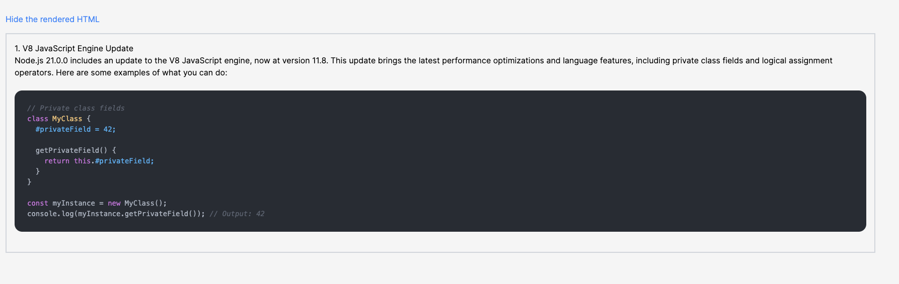

# Content Converter - Content to HTML tool

> Developed by: [**@VadimChorrny**](https://github.com/VadimChorrny)

## How to use this tool?

1. Open website: [**Content Converter**](https://content-converter-hvh3-cpsy18xhu-vadimchorrny.vercel.app)
2. Paste your content into the input field

3. Here you can see your content in HTML format and copy it


#### You can also see your content on html block

The Result will be like this:


## How to run this tool locally?

1. Clone this repository
2. Install dependencies
```shell
yarn install
```
3. Run the development server
```shell
yarn dev
```
4. Open [http://localhost:3000](http://localhost:3000) with your browser to see the result.
5. You can start editing the page by modifying `pages/index.tsx`. The page auto-updates as you edit the file.

That's all! Enjoy! 🎉
